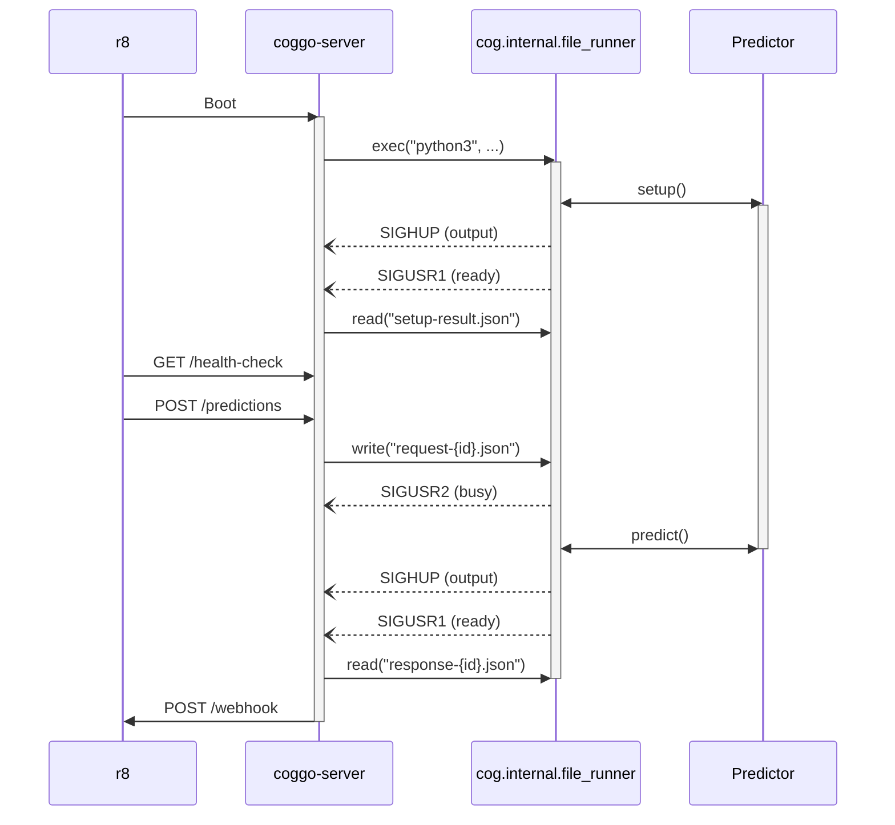

Coggo
=====

Alt-core [Cog] runtime implementation.

The original [Cog] seeks to be a great developer tool and also an arguably great
production runtime. Coggo is focused on being a fantastic production runtime _only_.

How is Coggo formed?



This sequence is simplified, but the rough idea is that the Replicate platform (`r8`)
depends on `coggo-server` to provide an HTTP API in front of a `cog.internal.file_runner`
that communicates via files and signals.

## `coggo-server`

Go-based HTTP server that known how to spawn and communicate with
`cog.internal.file_runner`.

## `cog.internal.file_runner`

Python-based model runner with zero dependencies outside of the standard library.
The same in-process API provided by [Cog] is avaaliable, e.g.:

```python
from cog import BasePredictor, Input

class MyPredictor(BasePredictor):
    def predict(self, n=Input(default="how many", ge=1, le=100)) -> str:
        return "ok" * n
```

In addition to simple cases like the above, the runner is async by default and supports
continuous batching.

Communication with the `coggo-server` parent process is managed via input and output files
and the following signals:

- `SIGUSR1` model is ready
- `SIGUSR2` model is busy
- `SIGHUP` output is available

[Cog]: <https://github.com/replicate/cog>
